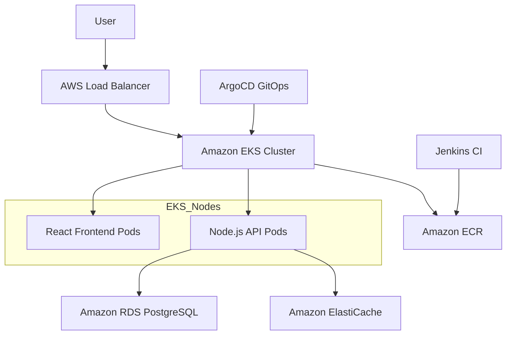

# Enterprise AWS DevSecOps Platform


A production-grade, end-to-end DevSecOps platform built on AWS. This project demonstrates industry best practices for Infrastructure as Code (IaC), Kubernetes orchestration, automated CI/CD pipelines, security scanning, and full-stack observability.



---

## 🏗 High-Level Architecture

The platform is architected for high availability, security, and scalability:

- **Networking (VPC):** Multi-AZ deployment across 3 availability zones with public/private subnet segregation. Egress controlled via NAT Gateways.
- **Compute (Amazon EKS v20):** Utilizes the modern **EKS Access Entry API** for superior IAM-to-Kubernetes security. 
- **Data Layer:**
  - **Relational:** Amazon RDS (PostgreSQL) with encrypted storage and cross-AZ failover.
  - **Caching:** Amazon ElastiCache (Redis) for low-latency data retrieval.
- **Continuous Integration (Jenkins):** Multi-stage pipelines enforcing:
  - **IaC Scanning:** Trivy and Checkov policy-as-code checks.
  - **Container Security:** Trivy image vulnerability scanning.
  - **Automated GitOps:** Updates Kustomize manifests to trigger deployments.
- **Continuous Delivery (ArgoCD):** GitOps controller ensuring the cluster state matches the repository.
- **Observability (LGTM Stack):** 
  - **Prometheus:** Cluster-wide metrics collection.
  - **Grafana:** centralized dashboards for real-time visualization.
  - **Loki:** Log aggregation with persistent storage in Amazon S3.
  - **Fluent Bit:** High-performance log shipping.

---

## 🚀 Key Enterprise Features Implemented

During the implementation, several critical production issues were resolved to ensure platform stability:

### 1. Modern Security (EKS v20 Upgrade)
Upgraded from legacy `aws-auth` ConfigMaps to the **AWS EKS Access Entry API**. This allows for direct IAM identity mapping to Kubernetes RBAC, reducing management overhead and improving the security posture.

### 2. Multi-Architecture Compatibility
Implemented **Docker Buildx (AMD64)** pipelines to ensure local development (e.g., on Apple Silicon Macs) produces images compatible with AWS Graviton or standard x86 worker nodes, preventing `exec format error` crashes.

### 3. Persistent Storage (EBS CSI Driver)
Automated the installation of the **Amazon EBS CSI Driver** add-on with OIDC-based IAM roles (IRSA). This enables dynamic provisioning of AWS persistent volumes, allowing Grafana and Prometheus to retain data across restarts.

### 4. Advanced Networking & Load Balancing
Deployed the **AWS Load Balancer Controller** to manage Application Load Balancers (ALB) directly via Kubernetes Ingress. Configured strict Security Group rules allowing traffic only from worker nodes to stateful services (RDS/Redis).

---

## 📂 Repository Structure

```text
root/
├── infrastructure/         # Modular Terraform (VPC, EKS, RDS, Redis, ECR, Secrets)
│   ├── modules/            # Reusable resource components
│   ├── environments/dev/   # Environment-specific configuration
│   └── Jenkinsfile         # Pipeline for Infrastructure Automation
├── kubernetes/             # GitOps Manifests
│   ├── base/               # Core resource definitions (Ingress, Autoscaler)
│   └── overlays/dev/       # Kustomize patches for development
├── applications/           # Microservices Source Code
│   ├── backend/            # Node.js Express API (RDS + Redis integration)
│   └── frontend/           # React + Nginx Production App
├── cicd/jenkins/           # Jenkins Pipeline (Jenkinsfile) for Apps
├── monitoring/             # Observability Stack (Helm Values)
└── docs/                   # Detailed Architectural Deep-dives
```

---

## 🛠 Setup & Deployment

### Prerequisites
- AWS CLI configured with Administrator access.
- Terraform >= 1.5.0.
- Docker Desktop with Buildx enabled.
- `kubectl`, `helm`, and `eksctl` installed.

### 1. Provision AWS Infrastructure
```bash
cd infrastructure/environments/dev
terraform init
terraform apply --auto-approve
```
*Note: This will output your VPC ID, EKS Cluster Name, and Database Password.*

### 2. Build and Push Applications
Log in to ECR and push the images using the multi-arch builder:
```bash
# Replace <ACCOUNT_ID> with your AWS ID
aws ecr get-login-password --region us-east-1 | docker login --username AWS --password-stdin <ACCOUNT_ID>.dkr.ecr.us-east-1.amazonaws.com

# Build & Push (AMD64)
docker buildx build --platform linux/amd64 -t <ACCOUNT_ID>.dkr.ecr.us-east-1.amazonaws.com/devsecops-backend:latest --push ./applications/backend
docker buildx build --platform linux/amd64 -t <ACCOUNT_ID>.dkr.ecr.us-east-1.amazonaws.com/devsecops-frontend:latest --push ./applications/frontend
```

### 3. Deploy Kubernetes Workloads
```bash
# Update Kubeconfig
aws eks update-kubeconfig --name devsecops-eks-dev --region us-east-1

# Create Application Secret (Manual Step)
kubectl create secret generic backend-secrets -n devsecops-apps \
  --from-literal=db_host=<RDS_ENDPOINT> \
  --from-literal=db_user=dbadmin \
  --from-literal=db_pass=<DB_PASSWORD> \
  --from-literal=db_name=devsecopsdb \
  --from-literal=redis_host=<REDIS_ENDPOINT>

# Apply Manifests
kubectl apply -k kubernetes/overlays/dev
```

### 4. Access the Platform
Retrieve the Load Balancer DNS:
```bash
kubectl get ingress -n devsecops-apps
```

---

## 🔒 Security & Environment Configuration

The application is refactored to use zero hardcoded credentials. 

### Local Development
1. Copy `.env.example` to `.env` in `applications/backend`.
2. Fill in your local or AWS-tunneled credentials.
3. `.gitignore` is pre-configured to ensure no `.env` or Terraform state files are ever committed.

### Production Security
- **IAM Roles for Service Accounts (IRSA):** Pods use fine-grained IAM roles instead of node-level permissions.
- **KMS Encryption:** All data at rest (S3, RDS, EBS, ECR) is encrypted with AWS managed keys.
- **Secrets Manager:** Sensitive DB credentials are automatically synced via the External Secrets Operator (optional) or managed via Kubernetes Opaque Secrets.

---

## 📊 Observability Stack

Access the pre-configured monitoring dashboard:
```bash
kubectl port-forward -n monitoring svc/grafana 3000:80
```
- **URL:** `http://localhost:3000`
- **User:** `admin`
- **Password:** Run `make get-grafana-pw`

---

## 📝 Troubleshooting

| Issue | Resolution |
| :--- | :--- |
| **Pending Monitoring Pods** | Ensure EBS CSI Driver is ACTIVE: `aws eks describe-addon --addon-name aws-ebs-csi-driver` |
| **ImagePullBackOff** | Verify image exists in ECR and check architecture: `docker manifest inspect <image>` |
| **403 Access Denied (ALB)** | Re-run the IAM policy update: `aws iam create-policy-version` (See docs) |
| **Backend Crash (500)** | Check DB connection strings and ensure Node Security Group allows port 5432 to RDS. |

---

## 📜 License
This project is licensed under the MIT License - see the LICENSE file for details.
